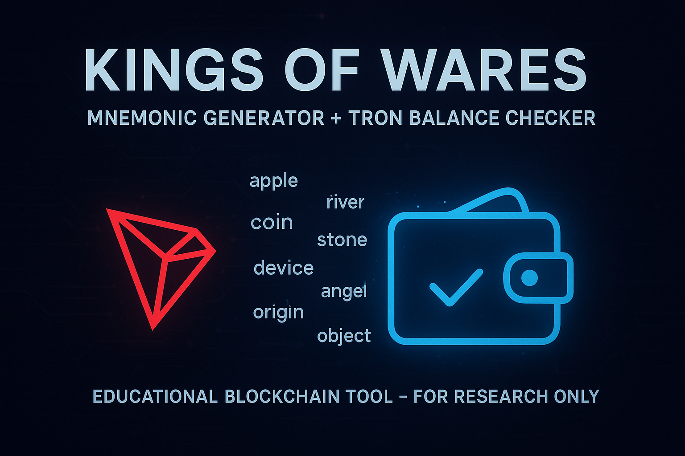

<!-- Banner -->
<p align="center">
  
</p>

<h1 align="center">👑 Kings Of Wares</h1>
<h3 align="center">Educational Blockchain Tools & Research</h3>

---

## 🌍 About This Project
This repository contains a **Python educational tool** that demonstrates how mnemonic phrases can be generated, connected to the **Tron blockchain**, and checked for balances.  
It is designed **for learning purposes only** — specifically to understand how wallets, addresses, and blockchain balances can be programmatically accessed.  

⚠️ **Disclaimer**:  
This project is strictly for **educational and research purposes**.  
It must **not** be used for malicious intent or unauthorized access to funds.  
By using this code, you agree that **Kings Of Wares and its contributors are not responsible for misuse**.  

---

## 🛠️ Features
- 🔑 **Mnemonic Generator** – Randomly generates wallet mnemonics  
- 🔗 **Tron Network Integration** – Connects to the Tron blockchain  
- 💰 **Balance Checker** – Scans generated wallets for balances  
- 📄 **Auto-Save** – If any funded wallet is detected, details are saved to a `.txt` file  
- ☁️ **VPS Ready** – Can be deployed and run 24/7 on a server  

---

## ⚡ Requirements
Make sure you have the following installed:
- Python 3.8+
- `tronpy` library
- `mnemonic` library
- A VPS (Linux/Ubuntu recommended for 24/7 execution)

Install dependencies:
```bash
pip install tronpy mnemonic
